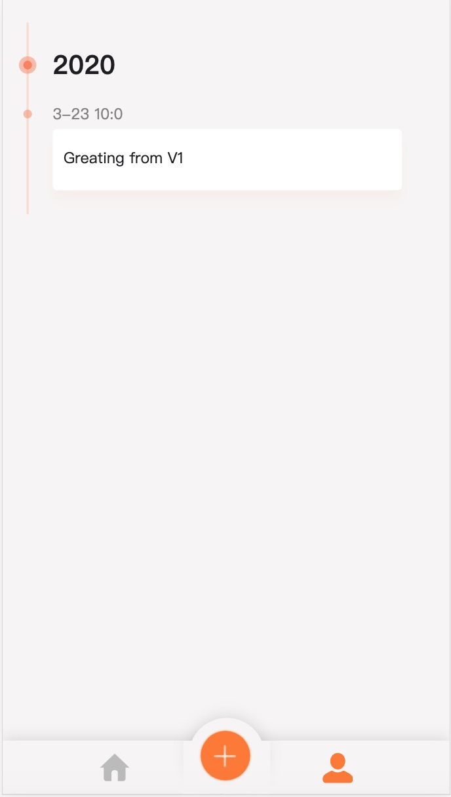
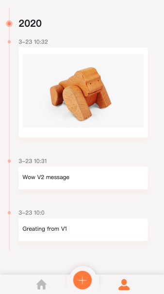

# 智能合约如何升级、版本控制
[repo](https://github.com/citahub/first-forever-demo/tree/feat-upgradable-contract)


当DApp开发迭代时，常见需要变更涉及合约状态结构的变更或者合约方法实现，参数，返回。
因为区块链不可变更的特性，智能合约在上线后如何升级回滚？

## 一种方式
在单合约场景，使用代理合约，不用把数据和逻辑分离，升级first-forever。

## 升级需求
需要升级合约支持图片或其他类型消息发送。
需要升级合约：
- 添加消息的方法
- 记录的数据结构。
```
// SimpleStoreV1:
mapping (address => mapping (uint256 => string)) private records;
function add(string memory text, uint256 time) public {...};
```

```
// SimpleStoreV2:
mapping (address => mapping (uint256 => Message)) private records;
struct Message {
    string msgType;
    string msgContent;
    uint256 msgTime;
}
function add(string memory text, uint256 time, string memory msgType) public {...};
```

## 如何升级SimpleStore：
#### 升级前后的代码：
[原版](https://github.com/citahub/first-forever-demo/tree/feat-origin-version)
[升级后，参考这个分支的代码实现](https://github.com/citahub/first-forever-demo/tree/feat-upgradable-contract)。

###  准备框架合约，在./src/contracts 目录下， 复制Delegated.sol和UpgradableManager.sol两个合约。
UpgradableManager.sol是升级的主要合约，也是DApp的配置的地址。在upgradeTo传入新的地址，调用migrate。在调用方法时，兜底方法代理执行最新合约里的方法。
```
// UpgradableManager
pragma solidity 0.4.24;
pragma experimental ABIEncoderV2;

contract UpgradableManager {
    address _implementation;
    address owner;
    address[] public delegates;
    string[] private versions;
    mapping(address => string) public delegateNames;
    event Upgraded(address implementation);

    constructor() public {
        owner = msg.sender;
    }

    modifier onlyOwner(){
        require(msg.sender == owner);
        _;
    }

    function implementation() public view returns (address) {
        return _implementation;
    }

    function inDelegates(address addr) public returns (bool) {
        for(uint i = 0; i < delegates.length; i++) {
            if(addr == delegates[i]) {
                return true;
            }
        }
        return false;
    }

    function getVersions() public returns (string[]){
        return versions;
    }

    function upgradeTo(address impl, string name) public onlyOwner returns (bool){
        require(_implementation != impl);
        // add to delegates
        _addToDelegates(impl, name);
        // call register manager
        impl.call(bytes4(keccak256("setManagerAddr(address,address)")), this, msg.sender);
        // call migrate
        bool isSuccess = impl.call(bytes4(keccak256("migrate(address)")), _implementation);
        // replace new implementation address
        _implementation = impl;

        emit Upgraded(impl);
        return isSuccess;
    }

    // fallback function
    function() payable external {
        address _impl = implementation();
        require(_impl != address(0));

        assembly {
            let ptr := mload(0x40)

        // (1) copy incoming call data
            calldatacopy(ptr, 0, calldatasize)

        // (2) forward call to logic contract
            let result := call(sub(gas, 10000), _impl, 0, ptr, calldatasize, 0, 0)
            let size := returndatasize

        // (3) retrieve return data
            returndatacopy(ptr, 0, size)

        // (4) forward return data back to caller
            switch result
            case 0 { revert(ptr, size) }
            default { return(ptr, size) }
        }
    }

    function _toVersionName(string name) private returns (string) {
        if(bytes(name).length > 0) {
            return name;
        } else {
            return string(abi.encodePacked("v", _uint2str(delegates.length)));
        }
    }

    function _addressToString(address _address) public pure returns(string memory) {
        bytes32 _bytes = bytes32(uint256(_address));
        bytes memory HEX = "0123456789abcdef";
        bytes memory _string = new bytes(42);
        _string[0] = '0';
        _string[1] = 'x';
        for(uint i = 0; i < 20; i++) {
            _string[2+i*2] = HEX[uint8(_bytes[i + 12] >> 4)];
            _string[3+i*2] = HEX[uint8(_bytes[i + 12] & 0x0f)];
        }
        return string(_string);
    }

    function _uint2str(uint i) internal pure returns (string){
        if (i == 0) return "0";
        uint j = i;
        uint length;
        while (j != 0){
            length++;
            j /= 10;
        }
        bytes memory bstr = new bytes(length);
        uint k = length - 1;
        while (i != 0){
            bstr[k--] = byte(48 + i % 10);
            i /= 10;
        }
        return string(bstr);
    }

    function _addToDelegates(address impl, string name) private {
        if(!inDelegates(impl)) {
            delegates.push(impl);
            string memory versionName = _toVersionName(name);
            delegateNames[impl] = versionName;
            string memory versionInfo = string(abi.encodePacked(versionName, ": ", _addressToString(impl)));
            versions.push(versionInfo);
        }
    }
}
```
需要升级的合约继承Delegated
```
pragma solidity 0.4.24;
import "./UpgradableManager.sol";

interface migration {
    function migrate(address prev) external;
}

contract Delegated is migration{
    address internal managerAddr;
    address internal owner;

    constructor() {
        owner = msg.sender;
    }

    modifier onlyOwner(){
        require(msg.sender == owner);
        _;
    }

    modifier onlyDelegatesAndOwner() {
        UpgradableManager manager = UpgradableManager(managerAddr);
        require(msg.sender == owner || manager.inDelegates(msg.sender));
        _;
    }

    function setManagerAddr(address _managerAddr, address senderAddr) public {
        require(senderAddr == owner);
        managerAddr = _managerAddr;
    }

    function migrate(address prev) public {}
}

```
### 编写可升级的合约， SimpleStoreV1.sol如下修改后， 使SimpleStoreV1变得可升级
```
import "./Delegated.sol";
// 申明SimpleStore是委托的
contract SimpleStore is Delegated 
```
###  编写新的合约SimpleStoreV2
1.申明SimpleStoreV2是可委托合约
2.修改新的合约状态和逻辑
3.编写migrate，将以前SimpleStoreV1的数据迁移至SimpleStoreV2中，migrate函数在升级中会被UpgradeManager自动完成。不需要迁移数据可以不写。
```
pragma solidity 0.4.24;
import "./SimpleStoreV1.sol";
import "./Delegated.sol";

contract SimpleStoreV2 is Delegated {
    mapping (address => mapping (uint256 => Message)) private records;
    mapping (address => uint256[]) private timeline;
    address[] private users;


    struct Message {
        string msgType;
        string msgContent;
        uint256 msgTime;
    }

    event Recorded(address _sender, string indexed _text, string msgType, uint256 indexed _time);

    function migrate(address prev) public {
        SimpleStore prevStore = SimpleStore(prev);
        migratingUser(prevStore);
        migratingTimeline(prevStore);
        migratingRecords(prevStore);
    }


    function migratingUser(SimpleStore prevStore) {
        address[] memory oldUsers = prevStore.getUsersForMigrating();
        users = oldUsers;
    }

    function migratingTimeline(SimpleStore prevStore) {
        for(uint i = 0; i< users.length; i++) {
            uint256[] memory timestamps = prevStore.getTimelineForMigrating(users[i]);
            timeline[users[i]] = timestamps;
        }
    }

    function migratingRecords(SimpleStore prevStore) {
        for(uint i = 0; i< users.length; i++) {
            address user = users[i];
            for(uint j = 0; j < timeline[user].length; j ++) {
                uint256 timestamp = timeline[user][j];
                string memory text = prevStore.getMessageForMigrating(user, timestamp);
                Message memory textMsg = Message("text", text, timestamp);
                records[user][timestamp] = textMsg;
            }
        }
    }

    function _addUser(address newUser) private {
        uint arrayLength = users.length;
        if(arrayLength == 0) {
            users.push(newUser);
        } else {
            bool found=false;
            for (uint i=0; i<arrayLength; i++) {
                if(users[i] == newUser){
                    found=true;
                    break;
                }
            }
            if(!found){
                users.push(newUser);
            }
        }

    }

    function _addToList(address from, uint256 time) private {
        timeline[from].push(time);
    }

    function getList()
    public
    view
    returns (uint256[] memory)
    {
        return timeline[msg.sender];
    }

    function add(string memory text, uint256 time, string memory msgType) public {
        Message memory message;

        if(keccak256(abi.encodePacked(msgType)) == keccak256("image")) {
            message = Message("image", text, time);
        } else {
            message = Message("text", text, time);
        }

        records[msg.sender][time]=message;
        _addUser(msg.sender);
        _addToList(msg.sender, time);
        emit Recorded(msg.sender, text, msgType, time);
    }

    function get(uint256 time) public view returns(string memory msgContent, string memory msgType,uint256 msgTime) {
        Message memory message = records[msg.sender][time];
        return (message.msgContent, message.msgType, message.msgTime);
    }

    function getUsersForMigrating() public view  onlyDelegatesAndOwner returns(address[]) {
        return users;
    }

    function getTimelineForMigrating(address addr) public view onlyDelegatesAndOwner returns(uint256[] memory) {
        return timeline[addr];
    }

    function getMessageForMigrating(address addr, uint256 timestamp) public view onlyDelegatesAndOwner returns (string memory msgContent, string memory msgType,uint256 msgTime){
        Message memory message = records[addr][time];
        return (message.msgContent, message.msgType, message.msgTime);
    }

}
```
####  完成两个合约修改后，我们需要将四个合约编译
```
cd src
truffle develop // 进入truffle开发模式中
compile // truffle 会把编译的json 输出到 .src/build/contract
```

编译的结果
```
src/build/contracts
├── Delegated.json
├── SimpleStore.json
├── SimpleStoreV2.json
└── UpgradableManager.json
```

####  将这四个合约批量部署， 脚本会读取build/contract所有的合约部署，并把链上的地址写回各个合约json，方便调试升级。
```
npm run deploy
```
编译后输出所有地址：
```
Delegated is: 0x1ddf21518203369f97845904b5ED12E75f5Ca476
migration is: 0x76a3000E30806ADdbAB3470E02D5117161a6cdA6
SimpleStore is: 0x4d03b3d9Dc8Ea1508405eB7fC4bc2536FD966ed1
SimpleStoreV2 is: 0x2F126e3E93D33BDF2a53a12450a76FEF305eE2A7
UpgradableManager is: 0x8cACAaC99A332ae489d12feF180F256e1BCb03fD
```
将UpgradableManager的地址配置到config.js, 作为DApp的合约地址，升级合约后，配置的地址不用改变。

####  先将V1地址注册到upgradableManager上：

1. upgrade会调用UpgradableManager的UpgradeTo方法注册最新的实现地址
2. upgrade将abi保存在UpgradableManager上
3. npm run versions 检查部署的版本
```
node ./src/contracts/upgrade.js ./src/build/contracts/SimpleStore.json
npm run versions
```
```
version:
SimpleStore: 0x4d03b3d9dc8ea1508405eb7fc4bc2536fd966ed1

current: SimpleStore: 0x4d03b3d9Dc8Ea1508405eB7fC4bc2536FD966ed1
```

#### DApp切到feat-origin-version 分支，使用第一版的DApp， 发一条消息。
```
git checkout feat-origin-version
npm start
```


### DApp切换到feat-upgradable-contract, 升级到SimpleStorageV2，合约和Dapp都支持发送图片。
```
git checkout feat-upgradable-contract
node ./src/contracts/upgrade.js ./src/build/contracts/SimpleStoreV2.json
npm run versions
```
结果输出：
```
version:
SimpleStore: 0x4d03b3d9dc8ea1508405eb7fc4bc2536fd966ed1,
SimpleStoreV2: 0x2f126e3e93d33bdf2a53a12450a76fef305ee2a7

current: SimpleStoreV2: 0x2F126e3E93D33BDF2a53a12450a76FEF305eE2A7
```
### 使用DApp 发一条文字，一条图片消息


在列表中能看到图片，也能看到v1的消息。合约的数据的迁移和方法升级已经成功。
